<div align="center">

# Awesome Emoji Studio

**コンセプトから書き出しまで、スタンプ制作をひとつのパイプラインに。**

パイプラインの設計は[MJbae](https://github.com/MJbae)。AI処理にはGeminiを使用しています。

[**パイプラインを試す ↗**](https://awesome-emoji-studio.vercel.app) · [設計を見る](docs/pipeline.md)

[English](README.md) · [한국어](README.ko.md) · **日本語** · [简体中文](README.zh-CN.md) · [繁體中文](README.zh-TW.md)

</div>

<div align="center">
<picture>
  <source media="(max-width: 600px)" srcset="docs/readme/pipeline/ja-mobile.svg">
  
</picture>
</div>

- **生成する前に、方針を決める。** 市場・アート・文化の観点から、制作の方向性を組み立てます。
- **キャラクターの特徴を、次の工程へ。** キャラクターの設定をもとに表情を考え、共通の参考画像を使ってイラストを生成します。
- **仕上げから書き出しまで。** 画像を処理し、タイトルとタグを生成。LINE・KakaoTalk・Telegram・OGQ向けのファイルをZIPにまとめます。

途中で結果を確認し、必要に応じて生成し直しながら進められます。パイプラインはブラウザでもデスクトップアプリでも動作し、バックエンドの構築は不要です。AIへのリクエストはGoogleに直接送信され、画像処理とZIP作成はお使いの端末内で行われます。

<details>
<summary><strong>アプリ画面を見る</strong></summary>


<sub>実際のアプリ画面。イラストは表示用のサンプルです。</sub>

</details>

## ローカルで起動

Node.js 22.12以上とnpm、ご自身の[Gemini APIキー](https://aistudio.google.com/apikey)をご用意ください。

```bash
git clone https://github.com/MJbae/awesome-emoji-studio.git
cd awesome-emoji-studio
npm install
npm run dev:web
```

デスクトップ版は`npm run dev:electron`で起動します。アプリ内でAPIキーを設定してください。

[パイプラインの設計](docs/pipeline.md) · [開発ガイド](docs/development.md) · [各言語のレビュー](docs/localization/README.md)

---

**あなたらしい表情を、このパイプラインで。** 気に入ったら、⭐で応援してください。
