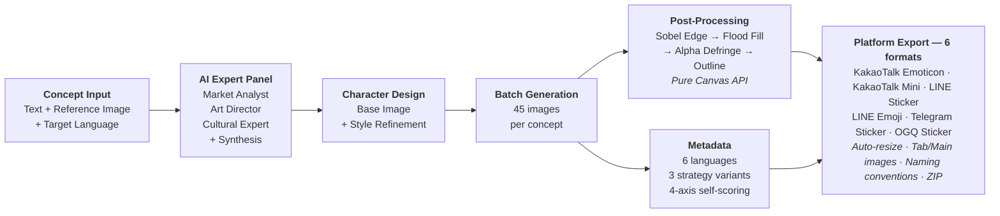

<div align="center">

# Awesome Emoji Studio

**AI-powered emoji pack factory — from concept to store-ready packages with zero backend.**

[](https://www.typescriptlang.org/)
[](https://react.dev/)
[](https://ai.google.dev/)
[](https://www.electronjs.org/)
[](https://vite.dev/)
[](#license)

<br />

Enter a character concept. Get **45 platform-compliant images**, background removal, outline rendering,
multilingual SEO metadata in **6 languages**, and submission-ready ZIPs for **6 storefronts** —
all processed client-side. No server. No uploads. Your API key never leaves your device.

<br />

[**Live Demo**](https://awesome-emoji-studio.vercel.app) · [**Download Desktop App**](https://github.com/user/awesome-emoji-studio/releases) · [**Get a Free API Key**](https://aistudio.google.com/apikey)

</div>

<br />



---

## Highlights

> Most AI image tools stop at "here is a picture." This project solves the **entire commercial pipeline** — from creative strategy to store submission.

<table>
<tr>
<td width="50%">

### Multi-Agent AI Strategy

Three specialized AI personas — Market Analyst, Art Director, and Cultural Expert — run a **structured deliberation** before a single image is generated. Market Analyst feeds Art Director; Cultural Expert runs in parallel. A synthesis step then combines all insights into a **45-emoji production plan** with categorized themes.

</td>
<td width="50%">

### Client-Side Computer Vision

Background removal powered by a **Sobel edge detection + flood fill + alpha defringing** pipeline, plus circular-offset outline rendering — all implemented from scratch using only the Canvas API. Zero native dependencies. Computer-vision-grade processing running entirely in the browser.

</td>
</tr>
<tr>
<td width="50%">

### 6 Storefronts, One Click

Produces submission-ready ZIP packages for **KakaoTalk** (Emoticon + Mini), **LINE** (Sticker + Emoji), **Telegram** (Static Sticker), and **OGQ Market** — each with correct dimensions, naming conventions, tab/main images, and file size limits.

</td>
<td width="50%">

### Zero Backend Architecture

Every operation runs client-side: Gemini API calls go directly from your browser to Google, image processing uses Canvas, ZIPs are built with JSZip, files download via Web Share API. **No server. No telemetry. No data collection.** API keys are encrypted with OS safeStorage on desktop.

</td>
</tr>
<tr>
<td width="50%">

### 85% Shared Codebase

Web and Desktop apps share **~6,985 lines of TypeScript** through a Bridge pattern adapter. The web shell is **10 lines**. The Electron shell is **~523 lines**. One codebase, two production-grade interfaces — with full security hardening on desktop (contextIsolation, sandbox, safeStorage).

</td>
<td width="50%">

### Culturally-Adapted for 6 Markets

Not just translation — **cultural product management**. Each target market (Korean, Japanese, Traditional Chinese, Simplified Chinese, Thai, English) gets custom prompt engineering for category distribution, humor style, and taboo avoidance. Thai prompts reference "sanuk" and "mai pen rai."

</td>
</tr>
</table>

---

## Key Features

### AI Expert Panel (Multi-Agent Prompting)

The strategy phase runs three specialized AI personas, not a single monolithic prompt:

1. **Market Analyst** — evaluates trends, competition, and positioning for the target market
2. **Art Director** — defines visual style, proportions, and expression range based on market data
3. **Cultural Expert** — adapts humor, gestures, and themes for cultural fit (runs in parallel with Art Director)

A **synthesis step** then combines all persona insights into a unified production plan with structured JSON output via Gemini response schemas.

### Self-Scoring Metadata Engine

The metadata generator produces **3 strategy variants** (personality, utility, creative) per language, each with a **4-axis self-evaluation**: naturalness, tone, searchability, and creativity. The UI auto-selects the highest-scoring option — essentially built-in quality assurance for AI output.

### Programmatic API

The web build exposes `window.emoticon` for scripting and automation:

```javascript
// Run the full pipeline from the browser console
const jobId = await window.emoticon.runFullPipeline(
  { concept: 'office worker rabbit', referenceImage: null, language: 'Korean' },
  'kakaotalk_emoticon',
);

// Subscribe to real-time progress events
const unsubscribe = window.emoticon.subscribe(jobId, ({ stage, current, total, message }) => {
  console.log(stage, `${current}/${total}`, message);
});

// Cancel at any time — propagates through AbortController to every async step
window.emoticon.cancelJob(jobId);
```

Backed by a job management system with UUID tracking, a status state machine (idle / running / paused / completed / failed / cancelled), LRU cleanup (max 10 jobs, 10-min TTL), and AbortController-based cancellation that reaches into rate-limit delays.

### Post-Process-Only Mode

Already have images? Upload existing PNGs, JPGs, or a ZIP (up to 120 images) and apply the full post-processing pipeline — background removal, outline rendering, and multi-platform export — without any AI generation.

---

## Getting Started

### Prerequisites

- **Node.js** >= 18
- **npm** >= 9
- **Gemini API Key** — get one free at [Google AI Studio](https://aistudio.google.com/apikey)

### Installation

```bash
git clone https://github.com/user/awesome-emoji-studio.git
cd awesome-emoji-studio
npm install
```

### Run

```bash
# Web — opens at http://localhost:5173
npm run dev:web

# Desktop — launches Electron app
npm run dev:electron
```

### Build

```bash
npm run build:web         # Production web build (Vercel-ready)
npm run build:electron    # Production desktop build (macOS universal + Windows x64)
```

### Test

```bash
npm run test              # Unit tests (Vitest)
npm run test:e2e          # E2E tests (Playwright — EN, JA, zh-TW)
npm run lint              # ESLint
```

---

## Security

- **API keys never leave your device.** Stored in `localStorage` (web) or OS-level encrypted `safeStorage` (Electron).
- **All AI calls go directly from your browser to the Gemini API.** No proxy, no middleware, no server.
- **Electron hardening**: `contextIsolation: true`, `nodeIntegration: false`, `sandbox: true`, `webSecurity: true`, navigation blocking, external link interception, single-instance lock.
- **No backend. No telemetry. No data collection.**

---

## License

MIT
