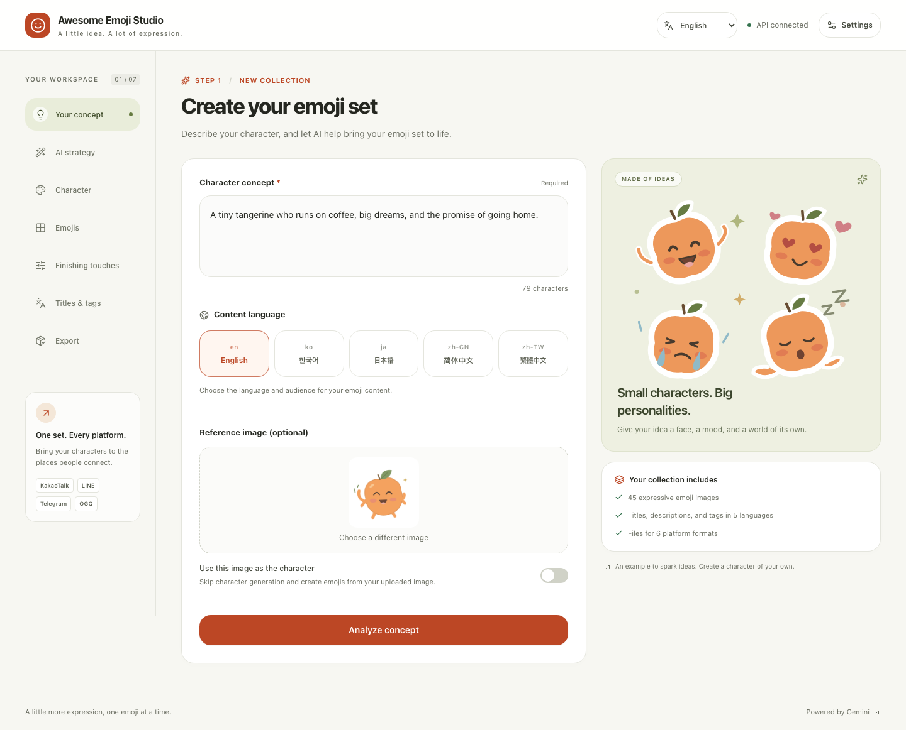

# Awesome Emoji Studio

**一個構想，一套完整的貼圖製作流程。**

流程由 [MJbae](https://github.com/MJbae) 設計，AI 階段由 Gemini 提供支援。

[**線上示範 ↗**](https://awesome-emoji-studio.vercel.app) · [認識流程設計](docs/pipeline.md)

[English](README.md) · [한국어](README.ko.md) · [日本語](README.ja.md) · [简体中文](README.zh-CN.md) · **繁體中文**

<picture>
  <source media="(max-width: 600px)" srcset="docs/readme/pipeline/zh-TW-mobile.svg">
  
</picture>

- **先想好方向，再開始生成。** 從市場、美術與文化角度，規劃創作策略。
- **延續角色的樣貌。** 依照角色細節規劃表情，再以同一張參考圖引導圖片生成。
- **完成製作流程。** 處理圖片、產生標題與標籤，再打包成適用於 LINE、KakaoTalk、Telegram 和 OGQ 的檔案。

你可以逐步檢視成果，依需要重新生成。

<strong>看看創作介面</strong>

實際應用程式介面，畫面中的貼圖為模擬範例。

[流程設計](docs/pipeline.md) · [語言審閱紀錄](docs/localization/README.md)

---

**喜歡這套流程嗎？** 點顆 ⭐，動手做一組有個性的貼圖。
