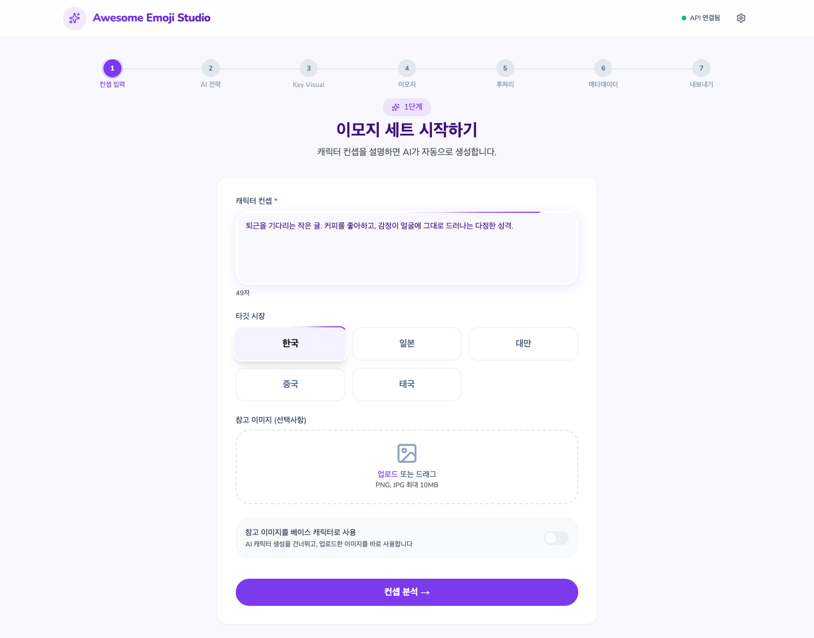
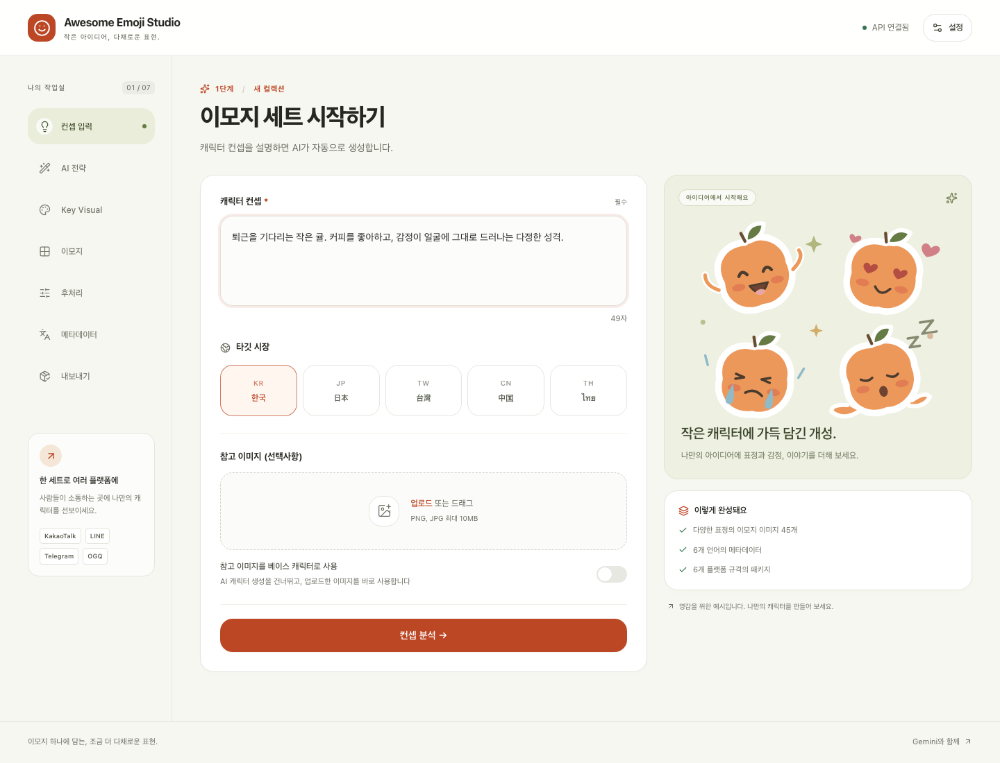

# 디자인 개선

[주요 프로세스 전체 전후 비교 — 웹·모바일 36장](process-design/README.md) · [단계별 비교 갤러리](process-design/index.html)

기존 생성·후처리·메타데이터·다운로드 흐름을 유지하면서 웹과 Electron이 공유하는 7개 단계의 디자인을 정리했습니다.

## 변경한 화면

- **작업 공간**: 따뜻한 밝은 배경, 짙은 본문, 주황색 기본 동작과 연한 초록색 현재 단계. 큰 화면의 세로 단계 탐색은 모바일에서 가로 탐색으로 전환됩니다.
- **컨셉 입력**: 입력 우선순위와 필수 항목을 명확히 하고, 시장 선택·참고 이미지·분석 버튼을 한 카드에 정리했습니다. 직접 제작한 SVG 예시 일러스트와 생성될 컬렉션의 구성 안내를 추가했습니다.
- **전략·캐릭터**: 접을 수 있는 전문가 의견, 투명 배경을 식별하는 이미지 작업 영역, 분리된 캐릭터 정보 패널로 내용을 읽기 쉽게 정리했습니다.
- **이모지·후처리**: 개별 편집·재생성 버튼을 터치와 키보드로 찾기 쉽게 표시하고, 진행률·미리보기·외곽선 옵션의 크기와 선택 상태를 개선했습니다.
- **메타데이터·내보내기**: 언어 선택, 결과 카드, 품질 점수, 플랫폼 규격, 다운로드 동작의 위계를 정리했습니다.
- **접근성**: 일관된 키보드 포커스, API 모달의 초기 포커스·포커스 순환·닫기 후 포커스 복귀, 건너뛰기 링크, 애니메이션 감소 설정, 명시적인 선택 상태와 입력 오류 연결을 추가했습니다.
- **공통**: 6개 언어에 새 문구를 추가했습니다. 외부 웹폰트 요청 대신 시스템 글꼴을 사용하고 앱 아이콘을 교체했습니다. API 키 저장 안내는 기기 저장과 Gemini 요청 사용을 정확히 설명합니다.

## 검증 중 수정한 UX 오류

- API 키를 검증하는 동안 비활성화된 저장 버튼에서 키보드 포커스가 배경으로 빠지는 문제를 수정했습니다.
- 320×260px처럼 높이가 낮은 화면에서도 설정 모달 내부를 스크롤하여 모든 항목에 접근할 수 있습니다.
- 완료한 입력 단계로 돌아왔을 때 기존 참고 이미지의 미리보기를 다시 표시합니다.
- 내보내기 상태가 초기화 과정에서 해제되던 순서 오류를 수정했습니다. 이제 ZIP 생성·저장 중에는 중복 내보내기와 뒤로가기가 비활성화됩니다.

## 실제 브라우저 화면

동일한 1440px 화면, 한국어, 동일한 입력으로 캡처했습니다. 스크린샷의 API 연결 상태는 테스트용 가짜 키를 사용합니다. 예시 귤은 저장소에 포함된 SVG 일러스트이며 생성 결과가 아닙니다.

| 변경 전 | 변경 후 |
| --- | --- |
|  |  |

[모바일 화면](design/after-mobile.png) · [설정 모달](design/after-settings.png)

## 검증

[테스트 결과와 커버리지 범위](testing.md)를 확인하세요. 회귀 테스트 통과와 소스 코드 분기 커버리지는 서로 다른 지표로 보고합니다. 소스 분기 100% 기준은 `npm run verify:design`의 필수 게이트입니다.
